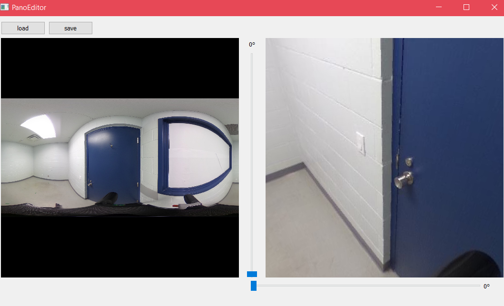
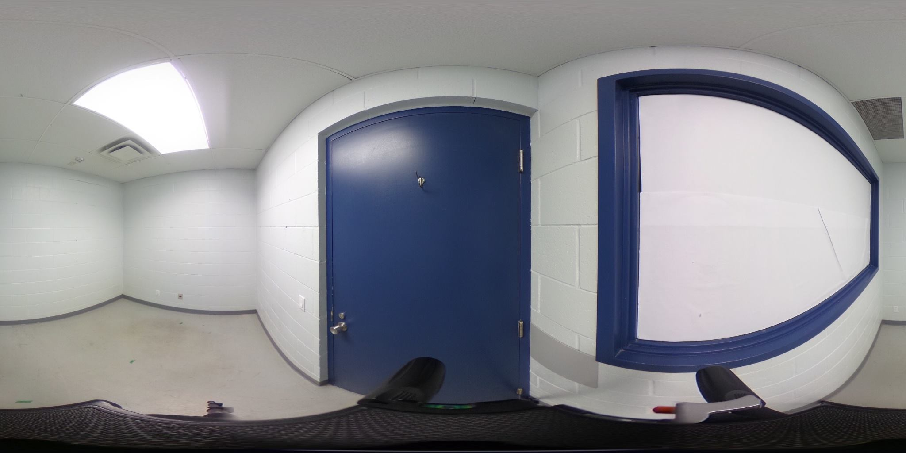
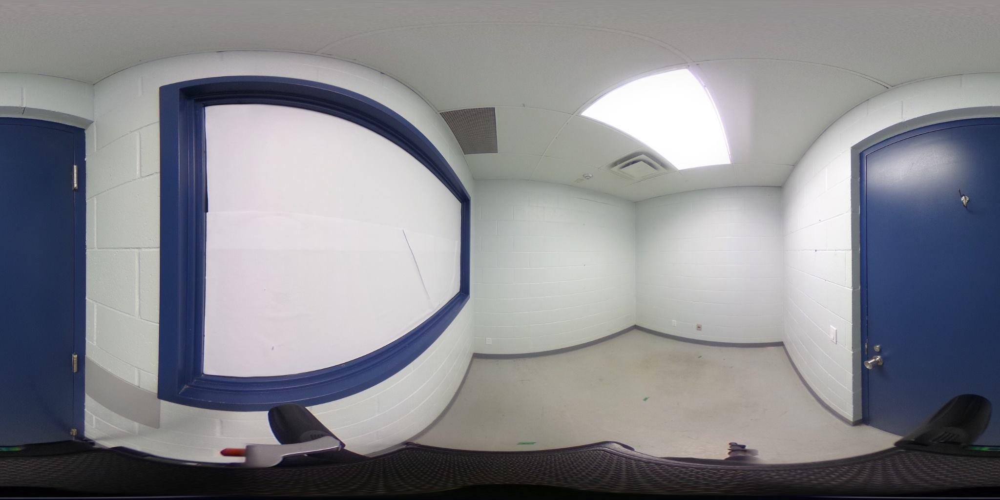
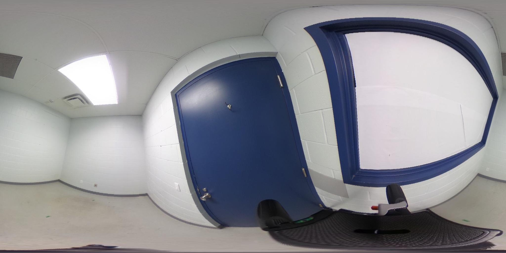

# Panorama Editor
This is a tool to visualise panoramic images in 3D and perform rotation on the initial image. 

Left : Display of 2D image.  
Right : Display of image projected on a cube (can be moved around using the mouse).  
left slider : Rotates the panorama horizontally.  
bottom slider : Rotates the panorama vertically.  

Here is an example of the rotation result:  

## Original image

## Image rotated by 90 degree horizontaly

## Image rotated by 15 degree vertically

